# Preparation
Create a GitHub account at https://github.com/

Follow the instructions to install git and set it up with GitHub https://docs.github.com/en/get-started/getting-started-with-git/set-up-git

# Introduction

## Version Control System
> In software engineering, version control (also known as revision control, source control, or source code management) is a class of systems responsible for managing changes to computer programs, documents, large web sites, or other collections of information.
[Wikipedia](https://en.wikipedia.org/wiki/Version_control)

## Git
> Git is a free and open source distributed version control system designed to handle everything from small to very large projects with speed and efficiency. [git-scm](https://git-scm.com/)

## GitHub
> GitHub is a developer platform that allows developers to create, store, manage and share their code. It uses Git software, providing the distributed version control of Git plus access control, bug tracking, software feature requests, task management, continuous integration, and wikis for every project. [Wikipedia](https://en.wikipedia.org/wiki/GitHub)

## Motivation
If more than one person works on the same project, using something like [GitHub](#github) makes development much more efficient, by allowing multiple people to work on parts of a software at the same time. Different changes made are often possible to merge automatically, and when automatic merging isn't possible it gives you a lot of control over what parts of each version you want to keep.

If you're working on a project solo it's still a good way to have a backup of your work in the cloud, as well as providing "checkpoints", so you can experiment, without having to worry about breaking something that was working before and not being able to undo it, because you can allways revert to a known good state.

# Basics

## Getting Started

### Creating a new repository
You can create a local git repository using the command line by navigating to the folder you want the repository in, and then executing the following command:
```sh
git init
```
You can do this in an empty folder if you want to start from scratch, or in an already existing project if you want to start tracking changes.

### Cloning
You can also clone existing repositories from GitHub (or similar platforms like GitLab) using the following command:
```sh
git clone [url]
```
This will download the contents of the repository with all of its history, and you can work on it offline. This will not affect the repository on the server unless you [push](#push) your changes.

## Local
Git is a distributed [VCS](#version-control-system), this means that once you have cloned a repository, you have a copy of it on your system and can work on it offline and independently of others.

### Status
```sh
git status
```
Shows the files that have been modified since the last commit, as well as commits that are out of sync with the [remote](#remote) repository.
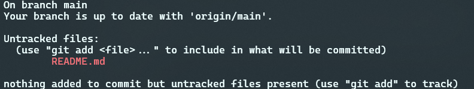
For example as I'm currently writing this readme, `git status` shows that this file is not tracked yet, and the main [branch](#branch) is up to date with the main [branch](#branch) on GitHub.

### Staging
```sh
git add [file] # add file to staging
git restore --staged [file] # remove file from staging
```
When using git, changes must be staged before [committing](#commit) them. This can be used for example if you have made multiple changes, but only want to commit some of them, you can choose which files to be included in the [commit](#commit).

If you want to add all of the changes at once, you can use `git add .`.

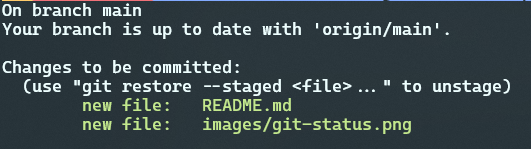

For example this is how `git status` looks like, after I add the README and the image I've put in the previous section to staging.

### Commit
```sh
git commit -m "[message]"
```
A commit is kind of like a checkpoint that stores changes made to the files in the repository. A message can be added to the commit, this can be anything, but it is good practise to **put a short description of the changes made** in the message.

Other than the message, a commit has a timestamp, an author, and a unique hash that identifies it. Commits made in the past can be [checked out](chekcout), this will show the files in the state they were in at the time of committing.

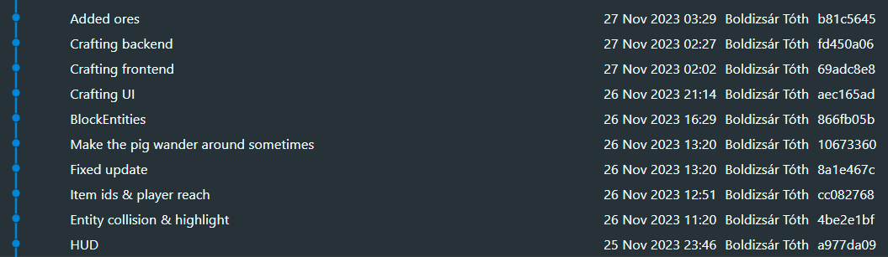

This is an example of a project with linear history.

### Stash
```sh
git stash # to put changes in the stash
git stash pop # to get the changes from stash
```
If you have un[committed](#commit) changes that you don't want to commit, but also want to get rid of temporarily (for example because of a conflict when [pulling](#pull)) you can stash them.

### Checkout
```sh
git checkout [branch_name]
git checkout [commit_hash]
```
`git checkout` can be used to checkout different versions of the repository. This can be done by the unique hash of a commit, or the name of a [branch](#branch). When checking out a [branch](#branch), it will automatically check out the latest commit on that [branch](#branch)

### Branch
```sh
git branch [name] # create a branch, but stay on the original
git checkout -b [name] # create & checkout a new branch
```
Branches can be used to work on different features in parallel, without interfering. This is mostly useful when more than one person works on different parts of the same project.

There are multiple different branching strategies. The most common are [Gitflow](https://www.atlassian.com/git/tutorials/comparing-workflows/gitflow-workflow) and [GitHub flow](https://docs.github.com/en/get-started/using-github/github-flow). The strategy we use on most of our project is based on GitFlow that looks like this:
- **main**: Code on the `main` branch is stable and ready to be used.
- **dev**: Code on the `dev` branch is still in development and not necessarily ready to be deployed.
- **feature-branches**: These are branching of from `dev`, and focus on a single [issue](#issue). They are merged back into `dev` via a [pull request](#pull-request) once completed.

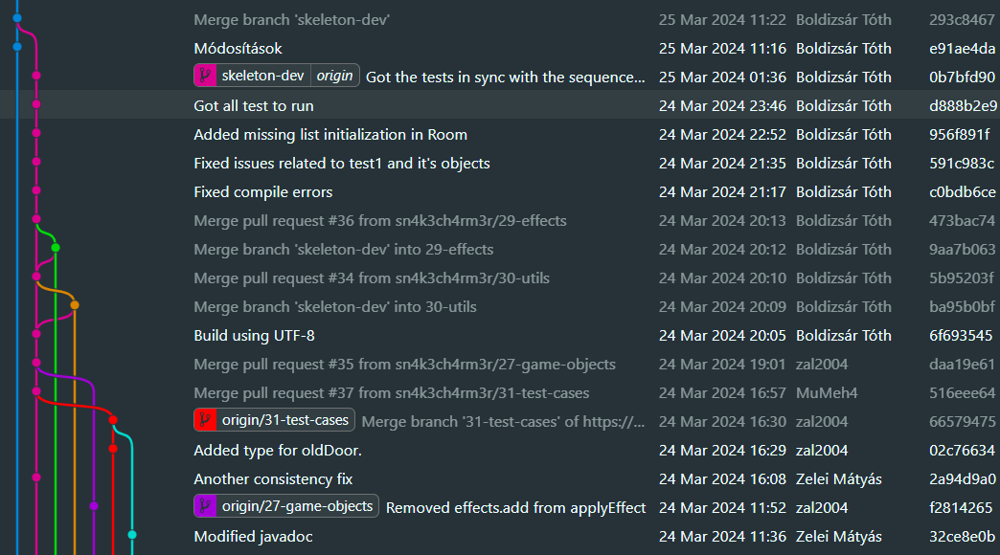

Similarly, we use this strategy on a university homework, where we need to build a software project in a team of 5.

### Merge
```sh
git merge [branch]
```
When you have multiple branches, `git merge` can be used to merge them. **Usage**: You need to [checkout](#checkout) the [branch](#branch) you want to merge **into**, and use `git merge [branch_to_merge_from]`.

This is used less frequently, as most often we handle this in the [remote](#remote) using [pull requests](#pull-request).

#### Merge Conflict
Sometimes merge conflicts can occur, when multiple branches have modified the same files.

##### Example
We have modified `merge.txt` on two different branches and now we tried to merge them. This couldn't be done automatically, because the same file is modified on both branches.

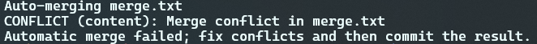

`git status` shows which files cause the conflict.

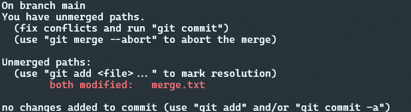

This can be resolved in any text editor, by selecting what you want to keep.

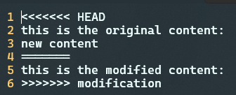

Modern IDEs make it a lot easier, by doing this partially automatically. For example in Visual Studio Code you can just click "Accept Current Change" to keep the version that is on the current branch.

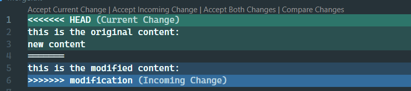

In this case if I want to keep both the modification and the added line I need to edit the file manually even in VSCode. 

After all the conflicts have been resolved, you need to [stage](#staging) and [commit](#commit) them just like you would any other change.

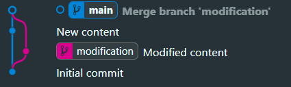

And this will be the resulting tree after merging.

## Remote
Local repositories can be linked to one or more remote repositoreis. This can be both to back up your work in the cloud, as well as share it with team members, or in case of open source projects with the public.

Many of the remote services like GitHub also offer many extra features, like [issues](#issue), [pull requests](#pull-request), project management tools, etc.

### Add remote
```sh
git remote add [name] [url] # the name can be anything, most often if you only have one remote it's "origin"
```

You can add a remote to a local repository with `git remote add`. This is needed if you have created your local repository first and you want to add remote tracking to it.

If you have [cloned](#cloning) a repository then the remote is already configured.

### Pull
```sh
git pull
```
When there are modifications in the remote, you can download the changes using `git pull`. If there are conflicting modifications you may need to [commit](#commit) or [stash](#stash) your changes before pulling.

### Fetch
```sh
git fetch
```
Similar to [pull](#pull), but it doesn't download the changes, only updates the status.

### Push
```sh
git push
```

Once you have commited some changes in your local repository you can push them to the remote. This will only work if your branch is up to date with the remote. If there are changes on the remote, you first need to [pull](#pull). 

### Issue
On GitHub you can create issues. An issue can be about a bug, a new feature, enhancements, etc. The description of the issue can be formatted using Markdown. 

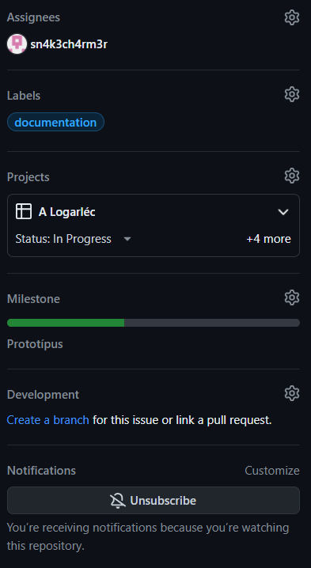

Issues can also have people assigned to them, they can be labeled, added to projects and milestones. They can also be linked to [branches](#branch) and [pull requests](#pull-request).

You can also comment on issues.

### Pull Request
Pull requests are used to merge branches on GitHub with more control than [`git merge`](#merge). When you create a pull request, you can provide a description of the changes included, similarly to [issues](#issue) this can be formatted using Markdown. Another important feature is that in a pull request you can see all of the changes made on the [branch](#branch) to be merged compared to the [branch](#branch) you're merging into.

Similar to [issues](#issue) pull requests can also be tagged, have people assigned to them, and [issues](#issue) can be linked to it. You can discuss the changes in the comments under the pull request, but it also has a feature where you can ask people to review your work.

You can also set up rules for example pull requests can only be merged, if the code passed all automated tests, and someone approved it in a review. It is also possible to specify code owners, so if you make a change to a certain part of the code, then you have to get an approving review from the person "owning" that part of the code.

# Extra

## Special Files

### README.md
This is what you're reading right now. It is a Markdown formatted file containing important information about the folder it's located in. On GitHub if a folder contains a README.md it is automatically displayed under the files.

### LICENSE
A license file contains information about what you can and can't do with the source code contained in the repository.

### .gitignore
A gitignore file lets you mark files and folders that you don't want to track. This most often includes build files and configuration related to your local development environment. 

For example ignoring Visual Studio Codes settings, the files in the `build` folder as well as any file ending in `.o` and `key.txt`.
```gitignore
.vscode/
build/
*.o
key.txt
```

There is also a private version of this, in `.git/info/exclude`. This can be used if you have some extra files you use during development, but aren't that generic, you can ignore them without having to update the projects `.gitignore`.

## Submodules
You can include other repositories in your project, without tracking its source code as a part of your own repository. 

You can add a submodule using 
```sh
git submodule add [repository_url] [path]
```
This will create a link to the third party repository, and its files will be download to the path specified.

Repositories containing submodules need to be cloned using
```sh
git clone --recursive
```

An example to this is FreeRTOS

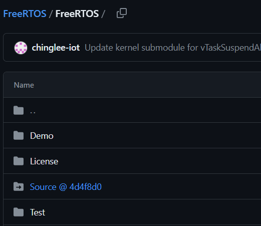

It contains FreeRTOS-Kernel as a submodule in `Source` here.

# Resources
## Other guides
- W3Schools: https://www.w3schools.com/git/	
- GeeksforGeeks: https://www.geeksforgeeks.org/git-tutorial/
## Practise
- Learn Git Branching: https://learngitbranching.js.org/