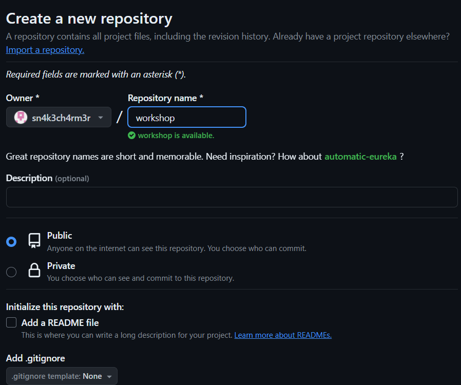
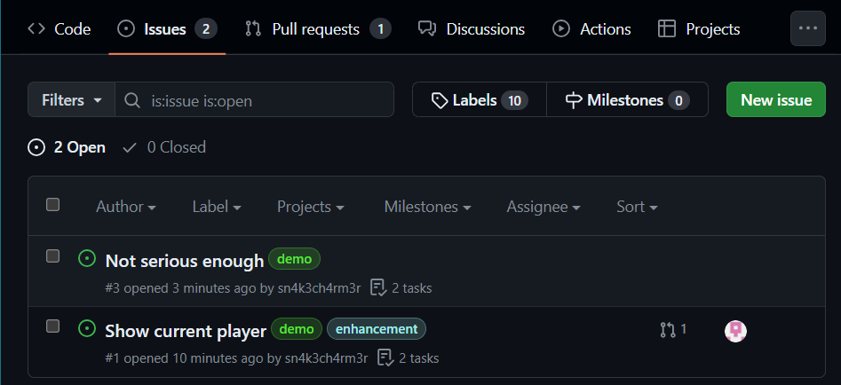
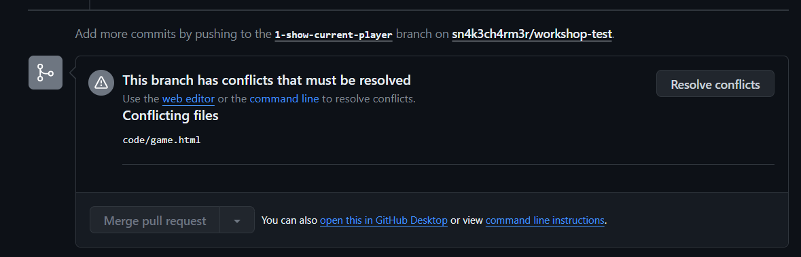

# Getting Started
Clone this repository using 
```sh
git clone https://github.com/sn4k3ch4rm3r/github-workshop
```

## Remote
If you want to play around more with GitHubs remote features create a new repository on GitHub 



There is another branch that won't get downloaded automatically, so you need to check it out using `git checkout 1-show-current-player`. Don't worry about it too much yet, just go back to the main branch using `git checkout main`.

After this set the remote url to your own repository using `git remote set-url origin http://github.com/<your-name>/<your-repo>` and update the remote using `git push --all`.

# Issues
You can see two open issues if you click on the "Issues" tab. Check them out!



As you can see one of them already has a contributor assigned to it. Now your task will be to work on the other issue.

## Remote
If you have created a repository for yourself to play around in, you can try and recreate these issues there as well.

# Branching
Before you begin, create a new branch where you can work on the issue. You can name it whatever you want, but if you want to stick to the convention its name should be `3-not-serious-enough`. Checkout this branch and start working.

# Commiting
Now you're on your new branch and start working. Edit the `game.html` file with your editor of choice. Once you're finished, commit your changes.

## Remote
You can also push your changes to your remote repository if you have created one. Since this is a new branch `git push` won't be enough, but it will tell you what you nee to do.

# Merging
Now that your work is done checkout the `main` branch and merge your work back into it.

## Remote
This is often done using a Pull Request, but for now stick to `git merge`. We will be looking at pull requests next.

# Conflicts
As you can see the other Issue has a Pull Request associated with it and it seems like someone has already worked on it.

## Local
If you don't have a remote repository, simply try to merge `1-show-current-player` into `main`. You will see that there is a merge conflict. Resolve the conflict and complete the merge. 

## Remote
If you do have a remote repository, recreate the Pull Request as you can see in this repo.



This will show that there is a conflict at the bottom, and won't let you merge unless it's resolved. Resolve the issue and merge the pull request.